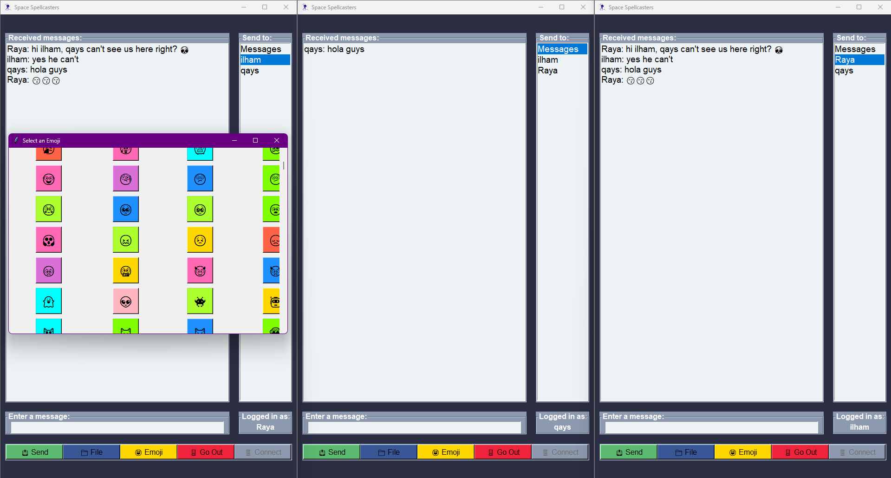

### Space Spellcasters Chat System 

---


# Space Spellcasters Chat System

The Space Spellcasters Chat System is a real-time communication application developed by Qays Sarayra, Ilham Thalji. It allows users to log in directly, send encrypted messages, and share emojis. The project is designed to be simple and secure, enabling seamless communication over a network without the need for a database.

## Table of Contents

- [Introduction](#introduction)
- [Direct Login](#direct-login)
- [Encrypted Messaging](#encrypted-messaging)
- [Emoji Support API](#emoji-support-api)
- [Usage](#usage)
- [File Storage](#file-storage)
- [Log File](#log-file)
- [Directory Structure](#Directory-Structure)

## Introduction

Welcome to the Space Spellcasters Chat System Project Documentation!

This documentation provides a comprehensive overview of the Space Spellcasters Chat System project. The Space Spellcasters Chat System is a real-time communication application that allows users to log in directly, send encrypted messages, and share emojis. It is designed with simplicity and security in mind, enabling users to communicate over a network without the need for a database. This documentation covers the setup, functionality, and technical details necessary to understand and use the Space Spellcasters Chat System.

## Direct Login

The Space Spellcasters Chat System allows users to log in directly, simplifying the user experience by eliminating the need for a database or extensive authentication processes. Each user connects to the chat server and begins communicating immediately.


## Encrypted Messaging

To ensure privacy and security, all messages exchanged between users in the Space Spellcasters Chat System are encrypted. This encryption protects the content of the messages from being intercepted or read by unauthorized parties. The encryption method used in this Chat System is XOR encryption, which is a simple yet effective technique for securing data.

```bash
    def encrypt_data(self, data):
        iv = os.urandom(16)
        cipher = Cipher(algorithms.AES(self.encryption_key), modes.CTR(iv), backend=default_backend())
        encryptor = cipher.encryptor()
        padder = padding.PKCS7(algorithms.AES.block_size).padder()
        padded_data = padder.update(data) + padder.finalize()
        encrypted_data = encryptor.update(padded_data) + encryptor.finalize()
        return iv + encrypted_data
```

### XOR Encryption and Decryption

XOR encryption works by taking each byte of data and performing an XOR operation with a corresponding byte from the encryption key. The same key is used for both encryption and decryption, making it a symmetric encryption method.

```bash
    def xor_encrypt(self, data, key):
        encrypted_data = ''.join(chr(ord(c) ^ ord(key[i % len(key)])) for i, c in enumerate(data))
        encoded_data = base64.b64encode(encrypted_data.encode()).decode()
        return encoded_data

    def xor_decrypt(self, data, key):
        decoded_data = base64.b64decode(data.encode()).decode()
        decrypted_data = ''.join(chr(ord(c) ^ ord(key[i % len(key)])) for i, c in enumerate(decoded_data))
        return decrypted_data

```

## Emoji Support API

Users can enhance their communication by sending emojis in the Space Spellcasters Chat System. It supports a wide range of emojis, allowing users to express themselves more effectively. To provide an extensive collection of emojis, the Space Spellcasters Chat System fetches additional emojis using an external API. This ensures that users have access to the latest and most popular emojis, enhancing their chat experience.

### Fetching Emojis from an API

The Space Spellcasters Chat System uses an API to fetch more emojis dynamically, ensuring that the emoji set is always up-to-date.
   ```
    website: https://emoji-api.com/
    key: b59e93777698c5f1b0db689ee9502c2b134e08c0
   ```


## Usage

To run the Space Spellcasters Chat System, follow these steps:

1. Open a terminal window.

2. Navigate to the directory containing the project files.
   
3. install requirements lib
   ```
   pip install -r requirements.txt
   ```


5. Run the server script:
   ```
   python server.py
   ```

6. Run the client script:
   ```
   python client.py
   ```

# you can open multiple clients



## File Storage

The Space Spellcasters Chat System stores files in the `server_files` directory. Any files sent or received during chat sessions are stored in this directory for later retrieval.

## Log File

The Space Spellcasters Chat System logs server actions and messages in the `file.log` file. This log file contains important information about user logins, message exchanges, and file transfers.

---
 

## Directory Structure

```plaintext

├── Chat app
│   ├── client.py
│   ├── server.py
│   ├── gui_helper.py
│   ├── model.py
│   ├── utils.py
│   ├── requirements.txt
├── logo
│   ├── Chat-App.png
├── server_files
│   ├── (empty)
├── __pycache__
│   ├── (contains Python bytecode files)
├── README.md
├── file.log
```
